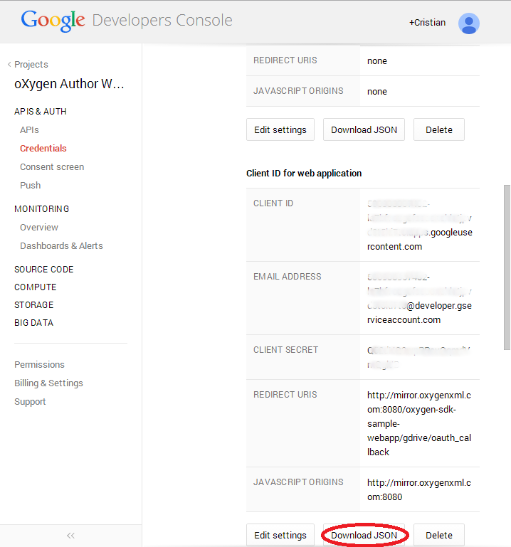

Google Drive integration plugin
===============================
This plugin installs a protocol handler for a protocol called **gdrive** in
**oXygen** used to access files stored on Google drive. That enables **oXygen** to open resources with a URL of the form: `gdrive://${userid}/path/to/file` where `${userid}` is the id of the user in whose Drive the file is located. 

This plugin provides a standard Java URL stream handler class
[URLStreamHandlerPluginExtension](http://www.oxygenxml.com/InstData/Editor/Plugins/javadoc/ro/sync/exml/plugin/urlstreamhandler/URLStreamHandlerPluginExtension.html) which uses the [Google Drive API](https://developers.google.com/drive/v2/reference/) to make connections to the handled URLs.

This plugin contains also the classes used to manage the OAuth flow and to store the
user's token which need to be linked in the [web.xml](../../ss-oxygen-sample-webapp/src/main/webapp/WEB-INF/web.xml#L54-98) configuration file.

It integrates with the Google Drive UI and contributes the **Open With** and
**Create New** actions in the Google Drive user interface. The **Create
New** action redirects to an HTML page which allows the user to choose the
template from which we should start, upload it to Google Drive and then launch the
editor. 

Classes summary
---------------
- **AuthCode**: The servlet responsible for receiving the OAuth token from Google
Drive. This servlet should be linked in the [web.xml](../../ss-oxygen-sample-webapp/src/main/webapp/WEB-INF/web.xml#L75-85) configuration file to handle the **redirect URL**. 

 If your server runs on `localhost:8080`, this means that the **redirectURL** is actually `http://localhost:8080/storage-services-oxy-integration/gdrive/oauth_callback`.
This URL should be specified in the [Google Developer
Console](https://console.developers.google.com/project) as described in the [Credentials Setup](#credentials-setup) section below.

- **Credentials**: The class used to load the Google Drive application secrets:
    application key, application secret and the redirect URL from a configuration file. 
- **CustomProtocolPlugin, CustomProtocolURLHandlerExtension**: The plugin
    classes.
- **GDriveUrlStreamHandler, GDriveUrlConnection**: used to map gdrive:// URLs to
    Google Drive files, make the actual communication with Google Drive and implements
    the URLStreamHandler. 
- **GDriveOperation**: An operation of Google Drive files, which may be retried if
    the OAuth token expired and needs to be refreshed. 
- **DbxManagerFilter**: The user manager which keeps track of the user on behalf of
    which the current request is executing. 
- **EntryPoint**: The entry point used for opening a file or creating a new file. As configured in the [web.xml](../../ss-oxygen-sample-webapp/src/main/webapp/WEB-INF/web.xml#L87-98) file, this servlet is usually bound to the **Open URL**: `http://127.0.0.1:8080/storage-services-oxy-integration/gdrive/start`. 

 **Note:** This URL should use **127.0.0.1** instead of **localhost** because the [Google Developer Console](https://console.developers.google.com/project) does not allow such a value.

- **TokenDb**: A simple db implemented on top of a .properties file.
- **UserData**: Details about an user, including its id and display name.

Implementation details
----------------------
When the user saves the file, the existing version is overwritten even if it was modified
    since the user last opened that file. However, all the versions of the file remain in
    Google Drive's history.

In Google Drive, the files and folders hierarchy is represented as a directed acyclic
    graph rather than as a tree, this makes resolving relative references hard. For this
    reason, we cannot open files with more than one ancestors on each level, and files which
    have siblings with the same name.

In Google Drive there are two kinds of files: files located in the user's Drive and files
    shared with the user. The path to the file in the URL for the former begins with
        **/home** and for the later with **/shared**

In XML projects, the documents usually have references to other files (schema files,
    xi:includes, etc.) and an action of the user may need access to multiple files. In order
    to access user's files Google gives us a token that expires after about an hour, in
    order to avoid the situation in which the user's action needs to be aborted due to an
    expired token, we request a permanent token. This has the side effect that user is asked
    to allow our application access his data while his device is turned off. However, we
    access the user's data only in response to user's actions. 

Credentials Setup
-----------------

In order to communicate with the Google Drive service, you need to setup a project in the [Google Developer Console](https://console.developers.google.com/project). 

Then, in the **APIs** submenu, you should enable the **Drive SDK**, **Drive
API** and **Google+ API**. The Google+ API is used to retrieve the author name.

The **Drive API** should be further customized, by accessing the settings menu by
clicking on the gear button near the **Drive API** label: . In the settings page, you should fill in the **Application Name**, **Short Description**, **Full Description** and upload several icons for the application. In the **Drive Integration** section you should change **only** the following
settings:

- **Open URL (Required) :** - The URL to which the **EntryPoint** servlet is
    bound, as described above.
- **Default MIME Types:** - *text/xml*

- **Default File Extensions:** - *xml, dita, ditamap*
- **Create With:** - The URL to which the **EntryPoint** servlet is bound, as
    described above.
- **Mobile Browser Support** - *checked*

The credentials of the app, can be found in the **Credentials** submenu. You
should **Create new Client ID**. The **Redirect URI** should be the URL where the
**AuthCode** is bound, as described above. The **Authorized Javascript
Origins** field is not important for us; leave it as it is.

You, then should download the credentials in JSON format, by using the **Download
JSON** button in the GUI.

**Note:** Please make sure that you download the credentials for the **Client ID** that you just created.

The downloaded file should be placed at the following path
`oxygens-sample-webapp/src/main/webapp/WEB-INF/gdrive-secrets.json`

See It in Action
----------------

In order to install the application in your **Google Drive**
account, you can go to [http://127.0.0.1:8080/storage-services-oxy-integration/gdrive/start](http://127.0.0.1:8080/storage-services-oxy-integration/gdrive/start) and follow the instructions there.
